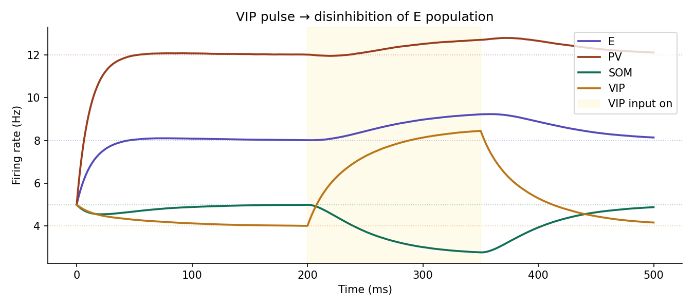
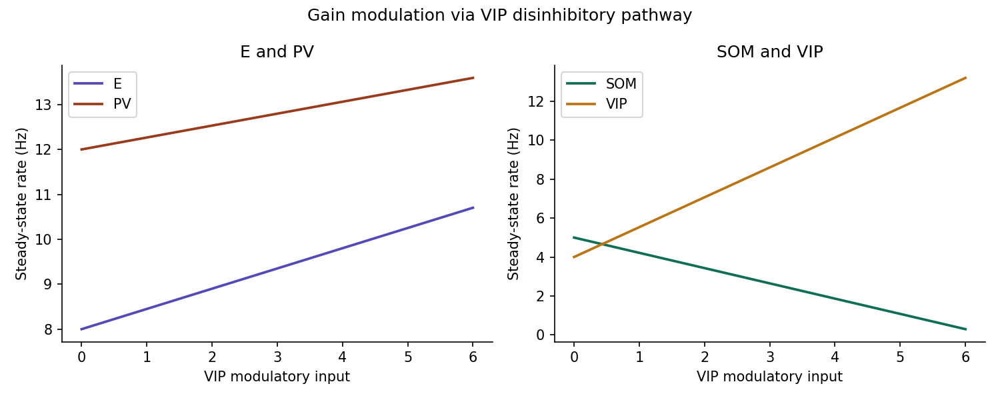

# Cortical Disinhibition

Experimenting with a model combining excitatory pyramidal cells (E) and inhibitory parvalbumin (PV), somatostatin (SOM), and vasoactive intestinal peptide (VIP) cells.

It is a simplified version of the model by [Wagatsuma et al. (2023)](https://academic.oup.com/cercor/article/33/8/4459/6706754), using Wilson-Cowan rate dynamics as opposed to spiking NN populations.

## Experiment 1
This figure shows the time course of each population, including turbulence from top-down VIP input.

## Experiment 2 (WIP)
This figure shows the steady state rate of each population at different levels of VIP input.

